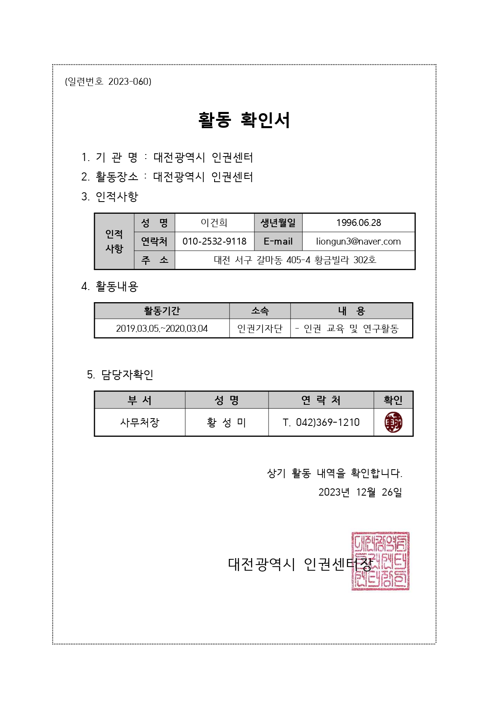
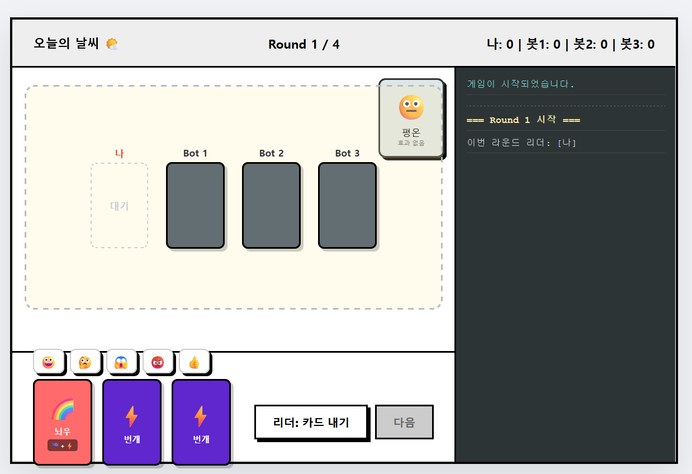
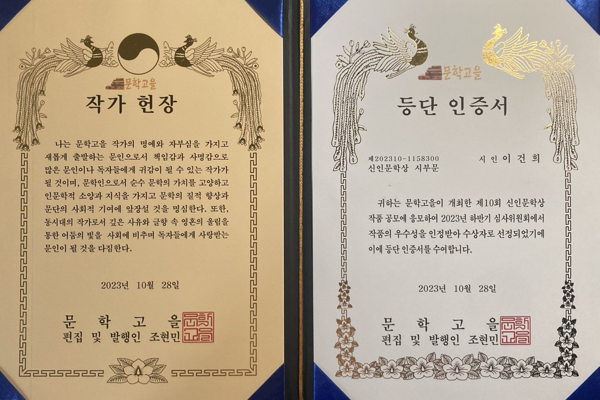
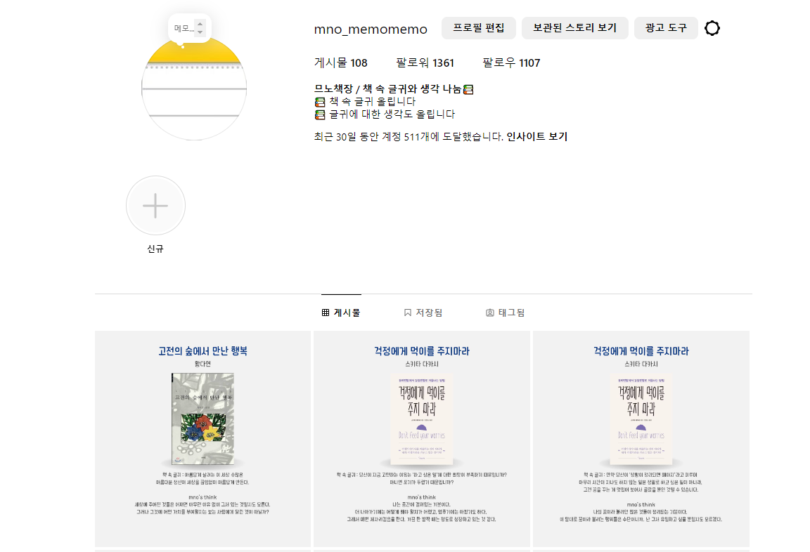

# [문제를 해결하는 제너럴리스트, 이건희입니다]

> "감성의 언어로 소통하고, 기술의 도구로 문제를 해결합니다."
>  
> 📧 Email: liongun3@naver.com | gunlee41@kakao.com  

---

## 1. 소개 (Introduction)

하나의 직무에 갇히기보다, **문제를 해결하는 데 필요한 도구를 가리지 않고 사용하는 보편적인 인재**입니다.  
글쓰기(기획), 디자인(시각화), 그리고 데이터와 코딩(구현)을 넘나들며, 조직에 비어 있는 부분을 채우고 **'일이 되게 만드는 역할'**을 수행합니다.

*▲ 대전 인권센터 기자단 활동 및 공익 활동 증빙*

---

## 2. 주요 프로젝트 (Projects)

### 📌 Project 1. AI 협업 게임 'Weather is What'
**"기획한 것을 끝까지 구현해내는 실행력"**

전문 코딩 지식이 없어도, **LLM(AI)을 파트너로 활용**하여 아이디어를 실제 작동하는 웹 서비스로 구현했습니다. 

* **역할:** 게임 기획(룰 디자인), AI 프롬프트 엔지니어링, 배포
* **기술:** HTML/CSS, JS, ChatGPT Prompting

  <a href="https://gunlee41.github.io/weatheriswhat/" class="btn">🎮 게임 플레이해보기</a>

 

### 📌 Project 2. 시집 <낚시> 출판 및 작가 활동
**"무(無)에서 유(U)를 만드는 기획력"**

단순 집필을 넘어 기획, 편집 디자인, 유통 계약까지 1인 출판의 전 과정을 수행하며 **완결성 있는 결과물**을 만들었습니다.

* **성과:** 등단 작가(신인상), 시집 독립출판, 매거진 기고
* **증빙:** [📄 잡지 기고문 보기](assets/images/magazine.pdf) / [📄 인터뷰 전문 보기](assets/images/interview.pdf)

| 시집 <낚시> 발간 | 등단 및 신인상 수상 |
| :---: | :---: |
|  |  |

 

### 📌 Project 3. 콘텐츠 채널 성장전략
**"데이터와 감성을 연결하는 마케팅"**

| 인스타그램 운영 | 브랜드 협찬 사례 |
| :---: | :---: |
|  |  |

---

## 3. 업무 스킬 & 자격 (Skills & Docs)

* **Google Analytics (GA4):** 데이터 기반 의사결정 ([📄 수료증](assets/images/GA.pdf))
* **Notion:** 협업 툴 구축 및 가이드 제작 ([📄 가이드](assets/images/notion.pdf))
* **Design:** 포토샵, 캔바, 미리디자인 활용 가능

---

### 감사합니다.
